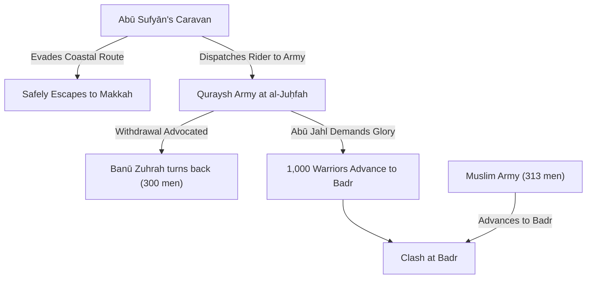
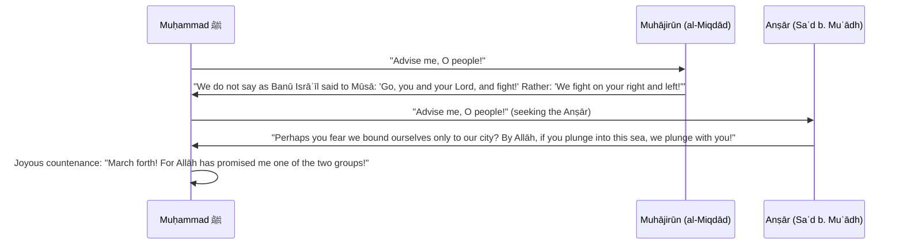
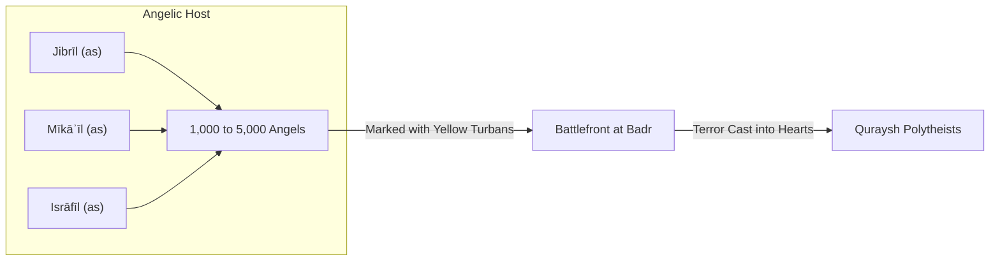

# Ghazwat Badr al-Kubrā (غزوة بدر الكبرى)
*The Great Battle of Badr — Yawm al-Furqān (The Day of the Criterion)*

> [!NOTE] Scholarly Provenance & Primary Source
> This entry is derived primarily from the encyclopedic compilation ***[[Subul al-Hudā war-Rashād fī Sīrat Khayr al-ʿIbād]]*** (*The Paths of Guidance and Righteousness in the Life of the Best of Servants*) by the 10th-century Shāfiʿī ḥadīth master and historian **[[al-Ṣāliḥī|Imām Shams al-Dīn Muḥammad b. Yūsuf al-Ṣāliḥī al-Shāmī]]** (d. 942 AH / 1536 CE), Volume 4, *al-Bāb al-Sābiʿ: Fī Ghazwat Badr al-Kubrā* (pp. 18–177). Al-Ṣāliḥī synthesizes over three hundred primary works, prominently synthesizing [[Ibn Isḥāq]], [[Mūsā b. ʿUqbah]], [[al-Wāqidī]], [[Ibn Saʿd]], [[al-Bukhārī]], [[Muslim]], [[al-Ṭabarī]], [[al-Suhaylī]] (*al-Rawḍ al-Unuf*), and [[Ibn Kathīr]] (*al-Bidāyah wan-Nihāyah*).

---

## 1. Nomenclature and Theological Distinction

In classical Islamic historiography, this battle bears several titles recorded by al-Ṣāliḥī (vol. 4, p. 18):
1. **Ghazwat Badr al-Kubrā (or al-ʿUẓmā)**: The Great Battle of Badr, distinguishing it from *Badr al-Ūlā* (the preliminary expedition of Safawān) and *Badr al-Mawʿid* (Badr the Promised, in 4 AH).
2. **Badr al-Qitāl**: Badr of Fighting, distinguishing it from peaceful gatherings at the seasonal Badr market.
3. **Yawm al-Furqān (يَوْمَ الْفُرْقَانِ)**: *The Day of the Criterion*, derived directly from the Divine text:
   $$\text{وَمَا أَنزَلْنَا عَلَىٰ عَبْدِنَا يَوْمَ الْفُرْقَانِ يَوْمَ الْتَقَى الْجَمْعَانِ}$$
   > *"And that which We sent down upon Our servant on the Day of the Criterion—the day the two hosts met."* (Qurʾān 8:41)
   
   Al-Ṣāliḥī notes from [[ʿAbdullāh b. ʿAbbās|Ibn ʿAbbās]] (authenticated by [[al-Ḥākim]]) that Allāh named it *Yawm al-Furqān* because He decisively separated (*faraqa*) therein between Truth (*al-ḥaqq*) and Falsehood (*al-bāṭil*), humiliating idolatry and elevating the nascent Islamic state (*Subul al-Hudā*, 4:18).

---

## 2. Strategic Context & The Cause of Departure (*Sabab al-Khurūj*)

### The Economic Blockade of Quraysh
Following the [[al-Hijrah|Migration]] to [[al-Madīnah al-Munawwarah]], the Muslim community faced systemic dispossession; the polytheists of [[Quraysh]] had confiscated the properties, homes, and capital left behind in [[Makkah]] by the [[al-Muhājirūn]]. In response, the Prophet [[Muḥammad b. ʻAbdullah|Muḥammad]] ﷺ initiated strategic interdictions against the Meccan trade lifeline to ash-Shām (Syria).

Prior reconnaissance operations had tracked this specific convoy on its outward journey to Syria, culminating in [[Ghazwat al-ʿUshayrah]] (Jumādā al-Ūlā, 2 AH), where the caravan narrowly evaded capture (*Subul al-Hudā*, 4:17). The Prophet ﷺ kept scouts alert for its return journey to Makkah.

### The Syrian Caravan of Abū Sufyān
In Shaʿbān 2 AH, intelligence reached Medina that **[[Abū Sufyān b. Ḥarb]]** was returning from Syria at the head of a gargantuan caravan carrying:
- **1,000 camels** laden with high-value goods (silk, perfumes, silver, grain).
- An estimated total wealth of **50,000 gold dinars** (*khamsīn alf dīnār*).
- An armed escort of merely **30 to 40 riders** (in some narrations, 70), including notables such as [[Makhramah b. Nawfal]] and [[ʿAmr b. al-ʿĀṣ]] (prior to their conversions).
- Representation from virtually every household in Quraysh; every clansman owning even a single mithqāl of gold had invested in this expedition (*Subul al-Hudā*, 4:18).

The Prophet ﷺ rallied the Muslims, saying:
> «هَذِهِ عِيرُ قُرَيْشٍ فِيهَا أَمْوَالُهُمْ، فَاخْرُجُوا إِلَيْهَا لَعَلَّ اللَّهَ أَنْ يُنَفِّلَكُمُوهَا»
> *"Here is the caravan of Quraysh containing their wealth. Go forth to intercept it; perhaps Allāh will grant it to you as spoils."* (*Subul al-Hudā*, 4:18)

Because intercepting a trading caravan was a targeted raid rather than a general mobilization for open warfare, the Prophet ﷺ did not make departure obligatory upon every able-bodied person. Only those whose mounts were readily present in the city set out.

---

## 3. Omens and Meccan Mobilization

### The Vision of ʿĀtikah bint ʿAbd al-Muṭṭalib
Three days prior to the arrival of the alarm in Makkah, the paternal aunt of the Prophet ﷺ, **[[ʿĀtikah bint ʿAbd al-Muṭṭalib]]**, experienced a terrifying dream (*Subul al-Hudā*, 4:19–20):
- A herald mounted upon a camel halted at the valley of al-Abṭaḥ, shouting: *"Mobilize, O people of treachery (*yā āla ghadar*), to your places of slaughter within three days!"*
- The mounted figure ascended [[Jabal Abū Qubays]], hurled a massive boulder downward; upon reaching the valley base, the boulder shattered, and not a single house or dwelling among Quraysh remained without a fragment entering it.

When ʿĀtikah shared this with her brother **[[al-ʿAbbās b. ʿAbd al-Muṭṭalib]]**, the news leaked through [[al-Walīd b. ʿUtbah]]. The following morning, **[[Abū Jahl (ʿAmr b. Hishām)]]** confronted al-ʿAbbās at the Kaʿbah with scathing ridicule:
> *"Are you not satisfied that your men claim prophethood, until your women now prophesy as well?! We will watch these three days; if your sister's words come true, so be it. If three days pass without incident, we will write a public decree that you are the greatest liars among all the Arabs!"* (*Subul al-Hudā*, 4:20)

### The Alarm of Ḍamḍam b. ʿAmr al-Ghifārī
On the third day, **[[Ḍamḍam b. ʿAmr al-Ghifārī]]**, whom Abū Sufyān had hired for twenty dinars to alert Makkah, burst into the valley. In the ancient Arabian custom of extreme distress:
- He had slit the nose of his camel (*jadda anfa baʿīrih*).
- Inverted its saddle (*ḥawwala raḥlah*).
- Torn his shirt down the front and back (*shaqqa qamīṣah*).
- Screaming from atop his mount: *"O assembly of Quraysh! The transport! Your wealth with Abū Sufyān has been intercepted by Muḥammad and his companions! Help! Help! (al-ghawth, al-ghawth!)"* (*Subul al-Hudā*, 4:21).

### The Wrath of Quraysh & The Diabolical Incitement of Iblīs
Incensed with pride and panic, Quraysh mobilized their nobility. Every nobleman marched in person or hired a warrior in his stead (as did [[Abū Lahab]], who paid his debtor [[al-ʿĀṣ b. Hishām b. al-Mughīrah]] 4,000 dirhams to fight in his place).

When fear arose that their ancestral enemies, the tribe of [[Banū Bakr b. ʿAbd Manāt min Kinānah]], might strike Makkah in their absence, **[[Iblīs]]** materialized in the physical form of **[[Surāqah b. Mālik b. Juʿshum]]** (a renowned chief of Kinānah), proclaiming:
> *"I am your protector and neighbor (*jār*) against Kinānah; no harm shall come from behind you."*
This diabolical event is commemorated in [[Sūrat al-Anfāl]]:
$$\text{وَإِذْ زَيَّنَ لَهُمُ الشَّيْطَانُ أَعْمَالَهُمْ وَقَالَ لَا غَالِبَ لَكُمُ الْيَوْمَ مِنَ النَّاسِ وَإِنِّي جَارٌ لَّكُمْ}$$
> *"And when Satan made their deeds pleasing to them and said: 'No one can overcome you today among the people, and indeed, I am your protector...'"* (Qurʾān 8:48; *Subul al-Hudā*, 4:22).

---

## 4. The Departure of the Muslim Army

The Messenger of Allāh ﷺ marched out of Medina on either the **8th or 12th of Ramaḍān, 2 AH** (*Subul al-Hudā*, 4:23).

### Administrative Appointments in Medina
- **Over the Prayers**: The blind Companion **[[ʿAbdullāh b. Umm Maktūm]]** (ra).
- **Over the Affairs of Medina**: Dispatched initially, then at [[al-Rawḥāʾ]], the Prophet ﷺ designated **[[Abū Lubābah b. ʿAbd al-Mundhir]]** (ra) to govern the civil affairs of the oasis city (*Subul al-Hudā*, 4:23).

### The Composition & Ranks
The force numbered between **313 and 317 men**:
- **Muhājirūn**: 82 to 86 men.
- **Anṣār**: 231 men (61 from the [[al-Aws]] and 170 from the [[al-Khazraj]]).
- **Mounts & Equippage**:
  - Only **two horses**: one belonging to **[[al-Miqdād b. ʿAmr]]** (named *Sabḥah*) and one belonging to **[[al-Zubayr b. al-ʿAwwām]]** (ra).
  - Approximately **70 camels**, ridden in rotation (*ʿuqbah*). The Prophet ﷺ, **[[ʿAlī b. Abī Ṭālib]]**, and **[[Marthad b. Abī Marthad al-Ghanawī]]** shared a single camel. When his two companions implored the Prophet ﷺ to ride while they walked, he answered with his consummate humility and fortitude:
    > «مَا أَنْتُمَا بِأَقْوَى مِنِّي عَلَى الْمَشْيِ، وَلَا أَنَا بِأَغْنَى عَنِ الْأَجْرِ مِنْكُمَا»
    > *"Neither of you is stronger than me in walking, nor am I in any less need of divine reward than you two."* (*Subul al-Hudā*, 4:24; narrated by Imām Aḥmad).

### Standards & Banners (*al-Alwiyah war-Rāyāt*)
- **The Great White Banner (*al-Liwāʾ al-Aʿẓam*)**: Entrusted to the noble youth **[[Muṣʿab b. ʿUmayr]]** al-Qurashī al-ʿAbdarī (ra).
- **The Banner of the Muhājirūn (*Rāyat al-Muhājirīn*)**: Entrusted to **[[ʿAlī b. Abī Ṭālib]]** (ra), known as *al-ʿUqāb* (The Black Eagle).
- **The Banner of the Anṣār (*Rāyat al-Anṣār*)**: Entrusted to the chief of the Aws, **[[Saʿd b. Muʿādh]]** (ra) (*Subul al-Hudā*, 4:24).

---

## 5. Strategic Intelligence and Reconnaissance

### The Coastal Escape of Abū Sufyān
Demonstrating extreme shrewdness, Abū Sufyān avoided the standard interior desert caravansary routes. Approaching Badr, he personally rode ahead, inspecting the watering stations. Meeting **[[Majdī b. ʿAmr al-Juhanī]]**, he inquired if any travelers had passed. Majdī replied that two mounted scouts had halted by the hillock, drank water, and departed. Abū Sufyān rode to their resting spot, broke open their camel droppings, and detected date pits:
> *"By Allāh, this is the fodder of Yathrib!"* (*ʿalaf Yathrib* — dates fed to camels only in Medina).
He instantly pivoted west, steering his caravan along the perilous Red Sea shoreline (*al-Sāḥil*), evading the Muslim interceptors entirely (*Subul al-Hudā*, 4:25).

Abū Sufyān then dispatched an urgent rider to the marching Meccan army:
> *"Turn back, for you only mobilized to safeguard your wealth, and Allāh has delivered your caravan."*

### Abū Jahl’s Arrogance (*al-Kibr*) & The Schism of Quraysh
Upon receiving Abū Sufyān's letter at [[al-Juḥfah]], the sensible elements within Quraysh advocated an immediate bloodless return. Chief among them was **[[al-Akhnas b. Sharīq]]**, who successfully persuaded the entirety of his clan, [[Banū Zuhrah]], to turn back (around 300 men; not a single Zuhrī fought at Badr). Similarly, [[Banū Hāshim]] under [[Ṭālib b. Abī Ṭālib]] sought to withdraw after insulting taunts from the Makhzūm clan.

However, **[[Abū Jahl (ʿAmr b. Hishām)]]** haughtily bellowed:
> *"By Allāh, we will not return until we march down to Badr, spend three days there, slaughter livestock, feast upon meat, pour out wine, and have the songstresses play for us, so that all of Arabia hears of our expedition and fears us for the rest of time!"* (*Subul al-Hudā*, 4:25).



### The Muslim Interrogation of the Water-Carriers
Unaware that the caravan had escaped and that an imperial army of 1,000 men was bearing down upon them, the Prophet ﷺ dispatched **[[ʿAlī b. Abī Ṭālib]]**, **[[al-Zubayr b. al-ʿAwwām]]**, and **[[Saʿd b. Abī Waqqāṣ]]** to the wells of Badr. They captured two water-boys: Aslam (servant of the Banū al-Ḥajjāj) and Yasār (servant of the Banū al-ʿĀṣ).

When questioned by the Companions, the boys insisted they belonged to the army of Quraysh. The Companions, desperately wishing the quarry to be Abū Sufyān's lightly guarded caravan, struck them until the boys falsely claimed: *"Yes, we belong to Abū Sufyān."*

The Prophet ﷺ, finishing his prayer, admonished his companions:
> *"When they spoke the truth you struck them, and when they lied you let them be! By Allāh, they spoke the truth; they belong to Quraysh."*

The Prophet ﷺ then demonstrated textbook military operational intelligence:
- He asked the boys: *«كَمِ الْقَوْمُ؟»* (*"How many are the enemy?"*) The boys replied: *"They are immense, we do not know their number."*
- He asked: *«كَمْ يَنْحَرُونَ كُلَّ يَوْمٍ؟»* (*"How many camels do they slaughter each day?"*)
- The boys replied: *"Nine on one day, ten on the next."*
- The Messenger of Allāh ﷺ turned to his men and stated:
  > «الْقَوْمُ فِيمَا بَيْنَ التِّسْعِمِائَةِ إِلَى الْأَلْفِ»
  > *"The enemy numbers between nine hundred and one thousand!"* (since an Arab camel fed roughly one hundred warriors).
- He then asked which nobles of Quraysh were with the army. The boys listed: ʿUtbah b. Rabīʿah, Shaybah b. Rabīʿah, Abū Jahl b. Hishām, Umayyah b. Khalaf, al-Naḍr b. al-Ḥārith, and others.
- The Prophet ﷺ looked at his companions and declared:
  > «هَذِهِ مَكَّةُ قَدْ أَلْقَتْ إِلَيْكُمْ أَفْلَاذَ كَبِدِهَا»
  > *"This is Makkah, casting down before you the very pieces of its liver (its foremost aristocracy)!"* (*Subul al-Hudā*, 4:25–26).

---

## 6. The Council of War (*al-Shūrā*)

With the caravan lost and a battle of annihilation looming against a force outnumbering them three-to-one, the Prophet ﷺ faced a profound constitutional and moral dilemma. Under the terms of the **[[Bayʿat al-ʿAqabah al-Thāniyah|Second Pledge of al-ʿAqabah]]**, the Anṣār had pledged to defend the Prophet ﷺ *within their own territory* (*fī diyārihim*); they were not legally bound by treaty to engage in offensive warfare beyond the borders of Medina.

The Messenger of Allāh ﷺ stood before the assembly and said:
> «أَشِيرُوا عَلَيَّ أَيُّهَا النَّاسُ»
> *"Advise me, O people!"* (*Subul al-Hudā*, 4:26).



### The Voices of the Muhājirūn
**[[Abū Bakr al-Ṣiddīq]]** spoke, and spoke excellently. Then **[[ʿUmar b. al-Khaṭṭāb]]** spoke, and spoke excellently.

Then arose **[[al-Miqdād b. ʿAmr]]** (ra), who uttered the immortal declaration contrasting the Ummah of Muḥammad ﷺ with the followers of Mūsā (as):
> «يَا رَسُولَ اللَّهِ، امْضِ لِمَا أَرَاكَ اللَّهُ فَنَحْنُ مَعَكَ، وَاللَّهِ لَا نَقُولُ لَكَ كَمَا قَالَتْ بَنُو إِسْرَائِيلَ لِمُوسَى: ﴿فَاذْهَبْ أَنتَ وَرَبُّكَ فَقَاتِلَا إِنَّا هَاهُنَا قَاعِدُونَ﴾ وَلَكِنِ: اذْهَبْ أَنْتَ وَرَبُّكَ فَقَاتِلَا إِنَّا مَعَكُمَا مُقَاتِلُونَ! وَالَّذِي بَعَثَكَ بِالْحَقِّ، لَوْ سِرْتَ بِنَا إِلَى بَرْكِ الْغِمَادِ لَجَالَدْنَا مَعَكَ مَنْ دُونَهُ حَتَّى تَبْلُغَهُ!»
> *"O Messenger of Allāh! Proceed to whatever Allāh has commanded you, for we are with you. By Allāh, we shall never say to you as the Children of Israel said to Moses: 'Go, you and your Lord, and fight; we are sitting right here!' Rather, we say: 'Go, you and your Lord, and fight; we are fighting alongside you!' By the One Who sent you with the truth, if you marched us even to the furthest shores of Bark al-Ghimād, we would battle alongside you until you attained it!"* (*Subul al-Hudā*, 4:26; *Ṣaḥīḥ al-Bukhārī*, no. 3952).

The face of the Prophet ﷺ beamed with joy. Yet he repeated a third time:
> «أَشِيرُوا عَلَيَّ أَيُّهَا النَّاسُ»
> *"Advise me, O people!"*

### The Covenant of the Anṣār: Saʿd b. Muʿādh
The leader of the Anṣār, **[[Saʿd b. Muʿādh]]** (ra), realized the Prophet ﷺ was addressing them directly. He rose and proclaimed (*Subul al-Hudā*, 4:26):
> *"Perhaps you fear, O Messenger of Allāh, that the Anṣār believe their duty to assist you is restricted only within their homes?*
> 
> *Indeed, I speak on behalf of the Anṣār and answer for them! Proceed wherever you desire, tie the bonds of whomever you wish, sever the bonds of whomever you wish, take from our wealth what you wish, and give us what you wish—and what you take from us is more beloved to us than what you leave behind.*
> 
> *By Allāh, if you were to lead us to this sea and plunge into its deep waters (*lawi staʿraḍta binā hādhā al-baḥr fa-khuḍtahu*), we would plunge into it with you; not a single man among us would turn back. We are patient in battle, resolute upon the encounter. Perhaps Allāh will display from us that which cools your eyes! March us forth upon the barakah of Allāh!"*

The Messenger of Allāh ﷺ was profoundly invigorated. His face radiated light, and he proclaimed:
> «سِيرُوا وَأَبْشِرُوا، فَإِنَّ اللَّهَ تَعَالَى قَدْ وَعَدَنِي إِحْدَى الطَّائِفَتَيْنِ، وَاللَّهِ لَكَأَنِّي الْآنَ أَنْظُرُ إِلَى مَصَارِعِ الْقَوْمِ!»
> *"March forth and rejoice! For Allāh has promised me one of the two parties (the caravan or the army). By Allāh, it is as though I am looking right now at the very places where the enemy will fall!"* (*Subul al-Hudā*, 4:26).

---

## 7. Tactical Geography & Operational Deployment

```
==============================================================================
               THE TOPOGRAPHY OF THE BATTLEFIELD AT BADR
==============================================================================

      [ North / Towards Medina ]
                |
          al-ʿUdwah al-Dunyā  (The Nearer Slope / Lower Bank)
          [ Muslim Camp ] — Firm, rained-on ground
                |
          Wells of Badr  <==== [Muslims advance here upon al-Ḥubāb's counsel]
          [Cistern built; all northern/rear wells filled]
                |
          al-ʿUdwah al-Quṣwā  (The Farther Slope / Higher Bank)
          [ Quraysh Camp ] — Muddy, marshy terrain behind sand dunes
                |
      [ South / Towards Makkah ]
==============================================================================
```

### The Topography Defined by the Qurʾān
The geopolitical staging of the field is immortalized in Surah al-Anfāl:
$$\text{إِذْ أَنتُم بِالْعُدْوَةِ الدُّنْيَا وَهُم بِالْعُدْوَةِ الْقُصْوَىٰ وَالرَّكْبُ أَسْفَلَ مِنكُمْ}$$
> *"[Remember] when you were on the nearer slope (*al-ʿudwah al-dunyā*), and they were on the farther slope (*al-ʿudwah al-quṣwā*), and the caravan was lower than you [along the sea]..."* (Qurʾān 8:42).

### The Tactical Intervention of al-Ḥubāb b. al-Mundhir
When the Muslim vanguard initially encamped at the nearest water well of Badr, **[[al-Ḥubāb b. al-Mundhir]]** (ra)—an Anṣārī veteran of desert combat dubbed *Dhū al-Raʾy* (The Man of Expert Counsel)—approached the Prophet ﷺ with profound prophetic etiquette:
> «يَا رَسُولَ اللَّهِ: أَرَأَيْتَ هَذَا الْمَنْزِلَ، أَمَنْزِلاً أَنْزَلَكَهُ اللَّهُ لَيْسَ لَنَا أَنْ نَتَقَدَّمَهُ وَلَا نَتَأَخَّرَ عَنْهُ، أَمْ هُوَ الرَّأْيُ وَالْحَرْبُ وَالْمَكِيدَةُ؟»
> *"O Messenger of Allāh: Have you viewed this encampment as a station that Allāh has revealed to you, such that we may neither advance beyond it nor retreat from it? Or is it a matter of tactical opinion, warfare, and military strategy?"*
The Prophet ﷺ replied:
> «بَلْ هُوَ الرَّأْيُ وَالْحَرْبُ وَالْمَكِيدَةُ»
> *"Rather, it is a matter of tactical opinion, warfare, and military strategy."*
Al-Ḥubāb said:
> *"O Messenger of Allāh, this is not the station. Move the men until we reach the well closest to the enemy. We shall encamp there, seal up and bury all the remaining wells behind us, construct a reservoir (*ḥawḍ*) over our well, and fill it with water. Thus, we shall engage them while we have water to drink and they have none!"*

The Prophet ﷺ smiled and endorsed his strategy:
> «لَقَدْ أَشَرْتَ بِالرَّأْيِ»
> *"You have indeed provided the sound counsel!"* (*Subul al-Hudā*, 4:27–28).
The army mobilized immediately in the dead of night and executed al-Ḥubāb's plan.

> [!TIP] Fiqh Insight: Revelation vs. Secular Expertise
> Sunni jurists cite the dialogue of al-Ḥubāb b. al-Mundhir as primary scriptural proof that tactical military matters, logistical engineering, and worldly administrative arts are subject to human experimentation, specialized counsel, and strategic reasoning (*ijtihād*), rather than rigid dogmatic prescription.

### The Command Post (*al-ʿArīsh*)
Recognizing that the survival of the Ummah was inextricably bound to the physical safety of the Prophet ﷺ, **[[Saʿd b. Muʿādh]]** suggested erecting a covered headquarters (*al-ʿArīsh*) on a high vantage point overlooking the battlefield:
- Sturdy mounts were hitched nearby so that if tragedy befell the army, the Prophet ﷺ could swiftly ride back to Medina, where a sincere cadre of believers remained who would lay down their lives for him.
- A select elite detachment of Anṣār, led by Saʿd b. Muʿādh with drawn swords, guarded the perimeter of the ʿArīsh day and night (*Subul al-Hudā*, 4:28).

---

## 8. The Night of Vigil & Divine Interventions

On the eve of **Friday, the 17th of Ramaḍān**, three miracles transformed the physical and psychological state of the two opposing armies (*Subul al-Hudā*, 4:28–31):

### 1. The Slumber of Security (*al-Nuʿās*)
While Quraysh spent a sleepless night consumed by anxiety, suspicion, and internal discord, Allāh cast an overwhelming, tranquil drowsiness (*nuʿās*) over the Muslim camp. Men slept peacefully on the edge of the battlefield, resting their bodies and pacifying their spirits:
$$\text{إِذْ يُغَشِّيكُمُ النُّعَاسَ أَمَنَةً مِّنْهُ}$$
> *"[Remember] when He covered you with a slumber as a security from Him..."* (Qurʾān 8:11).
ʿAlī b. Abī Ṭālib (ra) related: *"There was not a single horseman among us that night except al-Miqdād, and I saw all of us sleeping, except the Messenger of Allāh ﷺ beneath a tree, praying and weeping until morning arrived"* (*Subul al-Hudā*, 4:29; Imām Aḥmad).

### 2. The Cleansing Rain (*al-Maṭar*)
Allāh sent down rainfall upon the valley:
- Upon Quraysh, it fell as a torrent, turning their muddy valley ground (*al-ʿUdwah al-Quṣwā*) into a slippery, impassable mire.
- Upon the Muslims, it fell as a gentle shower that cleansed them of bodily impurities, alleviated the thirst of their pack animals, and consolidated the loose sand (*al-raml al-dahās*) into firm, solid turf beneath their footsteps (Qurʾān 8:11; *Subul al-Hudā*, 4:29).

### 3. The Prophetic Stride (*Maṣāriʿ al-Qawm*)
In the stillness of the night, the Messenger of Allāh ﷺ walked the sands of Badr with a staff in hand, placing it down at precise coordinates and foretelling:
> «هَذَا مَصْرَعُ أَبِي جَهْلٍ غَدًا إِنْ شَاءَ اللَّهُ، هَذَا مَصْرَعُ عُتْبَةَ، هَذَا مَصْرَعُ شَيْبَةَ، هَذَا مَصْرَعُ أُمَيَّةَ بْنِ خَلَفٍ...»
> *"This is the deathplace of Abū Jahl tomorrow, if Allāh wills; this is the deathplace of ʿUtbah; this is the deathplace of Shaybah; this is the deathplace of Umayyah b. Khalaf..."*
ʿUmar b. al-Khaṭṭāb (ra) swore by Allāh: *"Not a single one of them exceeded the boundary of the spot where the Messenger of Allāh ﷺ placed his hand!"* (*Ṣaḥīḥ Muslim*, no. 1779; *Subul al-Hudā*, 4:30).

---

## 9. The Day of Engagement: 17 Ramaḍān 2 AH

### Tactical Formation: The Ranks (*al-Ṣufūf*)
At dawn on Friday, the Prophet ﷺ marshaled the Muslim forces into military lines (*ṣufūf*)—a revolutionary departure from the traditional Arab cavalry-and-skirmish mob tactic (*al-karr wal-farr*):
$$\text{إِنَّ اللَّهَ يُحِبُّ الَّذِينَ يُقَاتِلُونَ فِي سَبِيلِهِ صَفًّا كَأَنَّهُم بُنْيَانٌ مَّرْصُوصٌ}$$
> *"Indeed, Allāh loves those who fight in His cause in a row as though they are a single structure joined firmly."* (Qurʾān 61:4).

While straightening the ranks with an unfeathered arrow shaft, the Prophet ﷺ tapped the protruding belly of **[[Sawād b. Ghaziyyah]]** (ra), saying: *«اسْتَوِ يَا سَوَادُ»* (*"Straighten up, O Sawād!"*). Sawād cried: *"You have hurt me, O Messenger of Allāh, and Allāh sent you with truth and justice; let me have retaliation (*aqidnī*)!"*
The Prophet ﷺ unhesitatingly uncovered his blessed abdomen and said: *«اسْتَقِدْ»* (*"Take your retaliation."*). Sawād embraced him and kissed his belly. When the Prophet ﷺ asked him why he had done so, Sawād replied:
> *"O Messenger of Allāh, you see what we are facing. I wanted the very last moment of my life in this world to be my skin touching your skin!"* The Prophet ﷺ prayed for his welfare (*Subul al-Hudā*, 4:33).

### The Battle Cry (*al-Shiʿār*)
The armies utilized standardized vocal recognition codes (*al-shiʿār*) to prevent friendly fire and unify hearts (*Subul al-Hudā*, 4:44):
- **General Muslim Slogan**: *«أَحَدٌ! أَحَدٌ!»* (*"Aḥad! Aḥad!" — The One! The One!*) and *«يَا مَنْصُورُ أَمِتْ!»* (*"Yā Manṣūr Amit!" — O you who are made victorious, slay!*).
- **The Muhājirūn**: *«يَا بَنِي عَبْدِ الرَّحْمَنِ»* (*"O sons of ʿAbd al-Raḥmān!"*).
- **The Khazraj**: *«يَا بَنِي عَبْدِ اللَّهِ»* (*"O sons of ʿAbd Allāh!"*).
- **The Aws**: *«يَا بَنِي عُبَيْدِ اللَّهِ»* (*"O sons of ʿUbayd Allāh!"*).

---

## 10. The Opening Duels (*al-Mubārazah*)

```
==============================================================================
                         THE CLASH OF THE NOBLES
==============================================================================
    QURAYSH ARISTOCRACY                          HASHIMITE CHAMPIONS
    -------------------                          -------------------
    ʿUtbah b. Rabīʿah          <== Dueling ==>   ʿUbaydah b. al-Ḥārith (ra)
    Shaybah b. Rabīʿah         <== Dueling ==>   Ḥamzah b. ʿAbd al-Muṭṭalib (ra)
    al-Walīd b. ʿUtbah         <== Dueling ==>   ʿAlī b. Abī Ṭālib (ra)
==============================================================================
```

### The Initial Provocation
Before the general engagement, **al-Aswad b. ʿAbd al-Asad al-Makhzūmī**, an arrogant polytheist, swore to drink from the Muslim cistern or die in the attempt. **[[Ḥamzah b. ʿAbd al-Muṭṭalib]]** (ra) intercepted him, severing his leg with a single stroke. As al-Aswad crawled toward the reservoir to fulfill his oath, Ḥamzah struck him down (*Subul al-Hudā*, 4:35).

### The Duel of the Six
Three aristocratic champions of Quraysh strode between the lines:
1. **ʿUtbah b. Rabīʿah** (senior elder of Quraysh).
2. **Shaybah b. Rabīʿah** (his brother).
3. **al-Walīd b. ʿUtbah** (his son, the fiercest youth of Makkah).

Three young men of the Anṣār bounded forward: **ʿAwf b. al-Ḥārith**, **Muʿawwidh b. al-Ḥārith** (the sons of ʿAfrāʾ), and **[[ʿAbdullāh b. Rawāḥah]]**. The Meccan champions barked: *"Who are you?"* They replied: *"A group of the Anṣār."* ʿUtbah sneered: *"Noble peers! But we have no business with you; we demand our equals from the sons of our paternal uncle!"*

The Messenger of Allāh ﷺ called out to his own household:
> «قُمْ يَا عُبَيْدَةَ بْنَ الْحَارِثِ، قُمْ يَا حَمْزَةُ، قُمْ يَا عَلِيُّ»
> *"Rise, O ʿUbaydah b. al-Ḥārith! Rise, O Ḥamzah! Rise, O ʿAlī!"* (*Subul al-Hudā*, 4:35).

The three Hashimite champions stepped into the clearing:
- **Ḥamzah** faced **Shaybah**: Ḥamzah dispatched him in seconds with a fatal strike.
- **ʿAlī** faced **al-Walīd**: ʿAlī struck him, severing his shoulder and killing him instantly.
- **ʿUbaydah** (the eldest at over 60 years) faced **ʿUtbah**: They exchanged blows; ʿUtbah severed ʿUbaydah's leg (*qaṭaʿa sāqahu*), while ʿUbaydah struck ʿUtbah's head.
- Ḥamzah and ʿAlī charged ʿUtbah, slew him, and carried ʿUbaydah back to the lines.

When placed before the Prophet ﷺ, ʿUbaydah placed his cheek upon the Prophet’s foot and asked: *"O Messenger of Allāh, if Abū Ṭālib were alive, would he know that I am more deserving of his verse:"*
> *«وَنُسْلِمَهُ حَتَّى نُصَرَّعَ حَوْلَهُ ... وَنَذْهَلَ عَنْ أَبْنَائِنَا وَالْحَلَائِلِ»*
> *('We shall not surrender him until we are struck down around him, oblivious of our children and our wives')?*
The Prophet ﷺ affirmed: *«أَشْهَدُ أَنَّكَ شَهِيدٌ»* (*"I bear witness that you are indeed a martyr!"*) (*Subul al-Hudā*, 4:36). ʿUbaydah succumbed to his wounds days later at [[Wādī al-Ṣafrāʾ]].

### Sabab al-Nuzūl: Surah al-Ḥajj (22:19)
Imām al-Bukhārī records from [[Abū Dharr al-Ghifārī]] and [[ʿAlī b. Abī Ṭālib]] (ra):
$$\text{۞ هَٰذَانِ خَصْمَانِ اخْتَصَمُوا فِي رَبِّهِمْ ۖ فَالَّذِينَ كَفَرُوا قُطِّعَتْ لَهُمْ ثِيَابٌ مِّن نَّارٍ}$$
> *"These are two adversaries who have disputed regarding their Lord. But those who disbelieved will have garments of fire cut out for them..."* (Qurʾān 22:19).
ʿAlī swore: *"I shall be the very first man to kneel upon his knees before the Most Merciful on the Day of Resurrection for the lawsuit (al-khuṣūmah)!"* (*Ṣaḥīḥ al-Bukhārī*, no. 3965; *Subul al-Hudā*, 4:36).

---

## 11. The Supplication in the ʿArīsh and Angelic Descent

With the opening duels lost, the polytheist multitude surged forward in massed columns. The Messenger of Allāh ﷺ re-entered the ʿArīsh with his sole companion, **[[Abū Bakr al-Ṣiddīq]]** (ra). Facing the Qiblah, raising his hands so high that the white of his underarms showed and his cloak (*ridāʾ*) slipped from his shoulders, he supplicated with volcanic intensity:
> «اللَّهُمَّ أَنْجِزْ لِي مَا وَعَدْتَنِي! اللَّهُمَّ آتِ مَا وَعَدْتَنِي! اللَّهُمَّ إِنْ تَهْلِكْ هَذِهِ الْعِصَابَةُ مِنْ أَهْلِ الْإِسْلَامِ لَا تُعْبَدْ فِي الْأَرْضِ!»
> *"O Allāh! Fulfill for me what You promised me! O Allāh! Grant me what You promised me! O Allāh! If this small band (*al-ʿiṣābah*) of Muslims is destroyed today, You will never be worshipped upon this earth!"* (*Subul al-Hudā*, 4:36; *Ṣaḥīḥ Muslim*, no. 1763).

Abū Bakr embraced him tenderly from behind, placed his cloak back upon his shoulders, and consoled him:
> *"Sufficient is your pleading to your Lord, O Messenger of Allāh! For He will surely fulfill what He promised you!"*

The Prophet ﷺ dozed momentarily, then lifted his head with radiant gladness:
> «أَبْشِرْ يَا أَبَا بَكْرٍ! أَتَاكَ نَصْرُ اللَّهِ! هَذَا جِبْرِيلُ آخِذٌ بِعَنَانِ فَرَسِهِ يَقُودُهُ عَلَى ثَنَايَاهُ النَّقْعُ!»
> *"Rejoice, O Abū Bakr! The victory of Allāh has come to you! Here is Jibrīl holding the reins of his horse (*Ḥayzūm*), leading it through the dust of battle!"* (*Subul al-Hudā*, 4:37; *Sunan Abī Dāwūd*).



### The Sīmā (Emblems) and Weapons of the Angels
Al-Ṣāliḥī details the physical manifestations of the angelic host (*Subul al-Hudā*, 4:39–44):
- **Angelic Insignia**: The angels descended upon piebald horses (*khayl bulq*), donning white and yellow turbans with tails hanging between their shoulder blades, in the identical likeness of **[[al-Zubayr b. al-ʿAwwām]]**, whose personal bravery and yellow turban were honored by Allāh (*Subul al-Hudā*, 4:44).
- **Physical Impact**: Companions like [[Sahl b. Ḥunayf]] reported: *"By Allāh, one of us would point his sword at the neck of a polytheist, and his head would tumble from his body before the blade made contact!"* (*Subul al-Hudā*, 4:40).
- **Burns of Light**: Those slain by the angels bore distinctive whip marks and singed wounds across their necks and fingertips, fulfilling the verse:
  $$\text{فَاضْرِبُوا فَوْقَ الْأَعْنَاقِ وَاضْرِبُوا مِنْهُمْ كُلَّ بَنَانٍ}$$
  > *"So strike above the necks and strike from them every fingertip."* (Qurʾān 8:12).

---

## 12. The Decisive Climax

The Prophet ﷺ stepped out from the ʿArīsh clad in armor, reciting the divine prophecy revealed years earlier in Makkah:
$$\text{سَيُهْزَمُ الْجَمْعُ وَيُوَلُّونَ الدُّبُرَ}$$
> *"Their assembly will be defeated, and they will turn their backs!"* (Qurʾān 54:45; *Subul al-Hudā*, 4:45).

### The Miracle of the Pebbles (*al-Ḥaṣbāʾ*)
The Prophet ﷺ instructed ʿAlī: *«نَاوِلْنِي كَفًّا مِنْ حَصْبَاءَ»* (*"Hand me a handful of pebbles."*). He cast the dust and gravel into the faces of the advancing Meccan army, crying:
> «شَاهَتِ الْوُجُوهُ!»
> *"Disfigured be their faces!"*
A sudden supernatural wind carried the dust into the eyes, nostrils, and mouths of every single polytheist warrior, throwing their ranks into utter chaos and blindness (*Subul al-Hudā*, 4:48). Regarding this, Allāh revealed:
$$\text{فَلَمْ تَقْتُلُوهُمْ وَلَكِنَّ اللَّهَ قَتَلَهُمْ ۚ وَمَا رَمَيْتَ إِذْ رَمَيْتَ وَلَكِنَّ اللَّهَ رَمَىٰ}$$
> *"And you did not kill them, but it was Allāh who killed them. And you threw not when you threw, but it was Allāh who threw..."* (Qurʾān 8:17).

### ʿUmayr b. al-Ḥumām and the Ranks of Paradise
Hearing the Prophet ﷺ declare:
> «قُومُوا إِلَى جَنَّةٍ عَرْضُهَا السَّمَاوَاتُ وَالْأَرْضُ!»
> *"Rise forth to a Paradise whose width is like the heavens and the earth!"*
The Khazrajī warrior **[[ʿUmayr b. al-Ḥumām]]** (ra) pulled out several dates to nourish himself before fighting. He paused, stared at the dates, and declared:
> *"Bakhin! Bakhin! (Splendid! Splendid!) If I live long enough to eat these dates, that would be a long life indeed!"*
He cast the dates aside, charged into the thick of the fray, and fought until he achieved martyrdom—becoming the first martyr of the Anṣār at Badr (*Subul al-Hudā*, 4:49; *Ṣaḥīḥ Muslim*, no. 1901).

### The Slaying of Umayyah b. Khalaf
**[[ʿAbd al-Raḥmān b. ʿAwf]]** (ra) had taken his pre-Islamic acquaintance **[[Umayyah b. Khalaf]]** and his son ʿAlī into protective custody as captives. As they walked, **[[Bilāl b. Rabāḥ]]** (ra)—who had endured torturous agony pinned beneath incandescent rocks in the sands of Makkah at Umayyah's hand—spotted his former tormentor. Bilāl bellowed:
> «رَأْسُ الْكُفْرِ أُمَيَّةُ بْنُ خَلَفٍ! لَا نَجَوْتُ إِنْ نَجَا!»
> *"The head of disbelief, Umayyah b. Khalaf! May I not survive if he survives!"*
Bilāl summoned the Anṣār, who surrounded them. Although ʿAbd al-Raḥmān tried to shield them with his own body, the righteous wrath of the oppressed overwhelmed the tyrant, and Umayyah and his son were slain on the spot (*Subul al-Hudā*, 4:51; *Ṣaḥīḥ al-Bukhārī*, no. 2301).

### The Fall of Abū Jahl (Pharaoh of the Ummah)
Two teenage Anṣārī youths from [[Banū Salimah]], **[[Muʿādh b. ʿAmr b. al-Jamūḥ]]** and **[[Muʿawwidh b. ʿAfrāʾ]]**, approached ʿAbd al-Raḥmān b. ʿAwf in the ranks, each quietly whispering:
> *"O uncle, show me Abū Jahl! I have heard he insults the Messenger of Allāh ﷺ; by Allāh, if I see him, my shadow shall not part from his shadow until the one of us destined to die first is slain!"*

When ʿAbd al-Raḥmān pointed him out surrounded by an armored thicket of swords, the two youths darted like two falcons and struck him down, severing his leg. ʿIkrimah b. Abī Jahl struck Muʿādh’s arm, leaving it dangling by its skin; Muʿādh stepped upon his own severed arm with his foot and tore it off to continue fighting unrestricted (*Subul al-Hudā*, 4:52).

Following the rout, the Prophet ﷺ ordered a search for Abū Jahl. **[[ʿAbdullāh b. Masʿūd]]** (ra)—the small, frail shepherd whom Abū Jahl had once slapped and humiliated in Makkah—found him drawing his final breaths. Ibn Masʿūd stepped upon his neck. Abū Jahl sneered with his dying breath:
> *"You have ascended a difficult peak, you lowly shepherd of sheep! Who is victorious today?"*
Ibn Masʿūd replied: *"Allāh and His Messenger, O enemy of Allāh!"* Ibn Masʿūd severed his head and brought it before the Prophet ﷺ, who praised Allāh three times and proclaimed:
> «هَذَا فِرْعَوْنُ هَذِهِ الْأُمَّةِ!»
> *"This was the Pharaoh of this Ummah!"* (*Subul al-Hudā*, 4:53).

---

## 13. The Aftermath

```
==============================================================================
                            CASUALTY METRICS
==============================================================================
    FORCE                  SLAIN / MARTYRED         CAPTURED / IMPRISONED
    -----                  ----------------         ---------------------
    Muslims (313)          14 Martyrs               0
                           (6 Muhājirūn, 8 Anṣār)
    Quraysh (~1,000)       70 Dead                  70 Captives
                           (Aristocratic Elite)     (Patricians & Warriors)
==============================================================================
```

### The Pit of Badr (*al-Qalīb*)
The Prophet ﷺ ordered the corpses of twenty-four polytheist ringleaders cast into an old, dry well (*Qalīb Badr*). He encamped on the battlefield for three nights. Prior to departure, he stood over the edge of the pit and addressed the corpses by name:
> «يَا أَبَا جَهْلِ بْنَ هِشَامٍ، يَا عُتْبَةَ بْنَ رَبِيعَةَ، يَا شَيْبَةَ بْنَ رَبِيعَةَ، يَا أُمَيَّةَ بْنَ خَلَفٍ! هَلْ وَجَدْتُمْ مَا وَعَدَ رَبُّكُمْ حَقًّا؟ فَإِنِّي قَدْ وَجَدْتُ مَا وَعَدَنِي رَبِّي حَقًّا!»
> *"O Abū Jahl b. Hishām! O ʿUtbah b. Rabīʿah! O Shaybah b. Rabīʿah! O Umayyah b. Khalaf! Have you found what your Lord promised you to be true? For I have indeed found what my Lord promised me to be true!"*

ʿUmar b. al-Khaṭṭāb (ra) asked: *"O Messenger of Allāh, do you speak to bodies that have no spirits?"*
The Prophet ﷺ responded:
> «مَا أَنْتُمْ بِأَسْمَعَ لِمَا أَقُولُ مِنْهُمْ، غَيْرَ أَنَّهُمْ لَا يَسْتَطِيعُونَ أَنْ يَرُدُّوا عَلَيَّ شَيْئًا»
> *"You do not hear what I say any better than they do, except that they are unable to send any reply back to me."* (*Subul al-Hudā*, 4:55; *Ṣaḥīḥ al-Bukhārī*, no. 3976; *Ṣaḥīḥ Muslim*, no. 2874).

### Dispatch of Tidings to Medina
The Prophet ﷺ dispatched two riders to deliver the joyous news to Medina:
- **[[ʿAbdullāh b. Rawāḥah]]** to the Upper Quarter of Medina (*al-ʿĀliyah*).
- **[[Zayd b. Ḥārithah]]** to the Lower Quarter (*al-Sāfilah*).

They entered the city as the Muslims were smoothing the soil over the grave of the Prophet's daughter, **[[Ruqayyah bint Rasūlillāh]]**, wife of **[[ʿUthmān b. ʿAffān]]** (ra). (ʿUthmān had stayed behind under the direct command of the Prophet ﷺ to nurse her, yet was credited by the Prophet ﷺ with a full participant's share of spoils and spiritual reward among the Badriyyūn).

---

## 14. Juristic & Quranic Resolutions: Spoils and Captives

### Division of Spoils (*al-Ghanāʾim*)
Disputes arose among the fighters regarding who owned the spoils: the vanguard who routed the enemy, the perimeter guards of the ʿArīsh, or the logistical detachments. Allāh revoked individual ownership, revealing the opening of [[Sūrat al-Anfāl]]:
$$\text{يَسْأَلُونَكَ عَنِ الْأَنفَالِ ۖ قُلِ الْأَنفَالُ لِلَّهِ وَالرَّسُولِ ۖ فَاتَّقُوا اللَّهَ وَأَصْلِحُوا ذَاتَ بَيْنِكُمْ}$$
> *"They ask you concerning the spoils of war. Say: 'The spoils of war belong to Allāh and the Messenger. So fear Allāh and settle all matters of dispute among yourselves...'"* (Qurʾān 8:1).
The Prophet ﷺ gathered all spoils and distributed them with absolute equity among the 313 Badriyyūn, allocating equal portions to horsemen and infantry (*Subul al-Hudā*, 4:58).

### The Dilemma of the Captives (*al-Asārā*)
The Prophet ﷺ convened a shūrā on the treatment of the seventy captives:
- **[[Abū Bakr al-Ṣiddīq]]** advised clemency and ransoming them: *"They are our cousins and kin; take ransom from them to strengthen our community, and perhaps Allāh will guide them to Islam later."*
- **[[ʿUmar b. al-Khaṭṭāb]]** advised capital retribution: *"They are the leaders of disbelief who exiled and combatted you. Hand over my relative to me so I may strike his neck, hand ʿAlī his brother ʿAqīl so he may strike his neck, and hand Ḥamzah his brother so he may strike his neck!"*

The Prophet ﷺ chose the compassionate counsel of Abū Bakr. Captives were ransomed between 1,000 and 4,000 dirhams. Those literate were granted freedom if they taught ten Muslim children of Medina how to read and write. Captives who were penniless were set free without ransom (*mannan bi-ghayri fidāʾ*).

Subsequently, the divine gentle admonition was revealed (*Subul al-Hudā*, 4:68):
$$\text{مَا كَانَ لِنَبِيٍّ أَن يَكُونَ لَهُ أَسْرَىٰ حَتَّىٰ يُثْخِنَ فِي الْأَرْضِ}$$
> *"It is not for a prophet to have captives until he has thoroughly subdued the land..."* (Qurʾān 8:67).

### Treatment of the Prisoners
The captives later testified to the sublime ethics of the Companions. One captive, Abū ʿAzīz b. ʿUmayr (brother of Muṣʿab), recorded:
> *"The people of Medina would give me the bread to eat while they themselves subsisted on mere dates, in compliance with the instruction of the Messenger of Allāh ﷺ to treat captives with kindness"* (*Subul al-Hudā*, 4:66).

---

## 15. The Spiritual Station of the Badriyyūn (*Ahl Badr*)

In Sunni creed (*ʿaqīdah*), the Companions who took part in Badr occupy the preeminent echelon of the Ṣaḥābah directly after the Four Rightly-Guided Caliphs. 

### The Absolute Pardon
In the famous hadith of [[Ḥāṭib b. Abī Baltaʿah]] recorded in the two *Ṣaḥīḥs*, the Prophet ﷺ rebuked ʿUmar for wanting to execute Ḥāṭib, saying:
> «وَمَا يُدْرِيكَ لَعَلَّ اللَّهَ تَبَارَكَ وَتَعَالَى قَدِ اطَّلَعَ عَلَى أَهْلِ بَدْرٍ فَقَالَ: اعْمَلُوا مَا شِئْتُمْ فَقَدْ غَفَرْتُ لَكُمْ!»
> *"What do you know? Perhaps Allāh looked down upon the people of Badr and declared: 'Do whatever you wish, for I have already forgiven you!'"* (*Ṣaḥīḥ al-Bukhārī*, no. 3007; *Ṣaḥīḥ Muslim*, no. 2494; *Subul al-Hudā*, 4:100).

### The Angelic Preeminence
Jibrīl (as) descended and asked the Messenger of Allāh ﷺ:
> *"How do you rank the people of Badr among yourselves?"*
> The Prophet ﷺ said: *«مِنْ أَفْضَلِ الْمُسْلِمِينَ»* (*"Among the foremost of Muslims."*)
> Jibrīl replied:
> *"Likewise are those angels who witnessed Badr regarded among the hosts of heaven!"* (*Ṣaḥīḥ al-Bukhārī*, no. 3992).

---

## 16. Key Figures Cross-Reference

| Figure | Affiliation | Crucial Role at Badr | Subsequent Event |
| :--- | :--- | :--- | :--- |
| **[[Muḥammad b. ʻAbdullah|Muḥammad b. ʿAbdullāh]] ﷺ** | Commander-in-Chief | Supplication in the ʿArīsh, casting pebbles | All Seerah |
| **[[ʿAlī b. Abī Ṭālib]] (ra)** | Muhājirūn / Hāshimī | Slays al-Walīd in duel; carries standard (*al-ʿUqāb*) | [[Ghazwat Uḥud]] |
| **[[Ḥamzah b. ʿAbd al-Muṭṭalib]] (ra)** | Muhājirūn / Hāshimī | Slays Shaybah in duel; kills al-Aswad | [[Ghazwat Uḥud]] (martyred) |
| **[[ʿUbaydah b. al-Ḥārith]] (ra)** | Muhājirūn / Muṭṭalibī | First champion duel; leg severed; martyr | [[Wādī al-Ṣafrāʾ]] (tomb) |
| **[[Saʿd b. Muʿādh]] (ra)** | Anṣār / Aws | Shūrā covenant speech; guards ʿArīsh | [[Ghazwat al-Khandaq]] |
| **[[al-Ḥubāb b. al-Mundhir]] (ra)** | Anṣār / Khazraj | Tactical water counsel (*raʾy wa-ḥarb*) | [[Saqīfat Banī Sāʿidah]] |
| **[[al-Miqdād b. ʿAmr]] (ra)** | Muhājirūn | Sole horseman; *"We fight on your right and left"* | [[Ghazwat Khaybar]] |
| **[[ʿUmayr b. al-Ḥumām]] (ra)** | Anṣār / Khazraj | Casts away dates; first Anṣār martyr | Martyred at Badr |
| **[[Bilāl b. Rabāḥ]] (ra)** | Muhājirūn | Executes tyrant Umayyah b. Khalaf | [[Fatḥ Makkah]] |
| **[[ʿAbdullāh b. Masʿūd]] (ra)** | Muhājirūn | Dispatches Abū Jahl (*Firʿawn hādhihi al-Ummah*) | Kūfah Scholarship |
| **[[Abū Jahl (ʿAmr b. Hishām)]]** | Quraysh / Makhzūm | Arch-enemy commander; instigates battle | Slain at Badr |
| **[[Abū Sufyān b. Ḥarb]]** | Quraysh / Umayyah | Leads caravan along coastal route to safety | [[Ghazwat Uḥud]] |

---

## 17. References & Classical Citations

1. **[[al-Ṣāliḥī]]**, Muḥammad b. Yūsuf al-Dimashqī. *[[Subul al-Hudā war-Rashād fī Sīrat Khayr al-ʿIbād]]*. Ed. ʿĀdil Aḥmad ʿAbd al-Mawjūd and ʿAlī Muḥammad Muʿawwaḍ. Beirut: Dār al-Kutub al-ʿIlmiyyah, 1414/1993, Vol. 4, pp. 18–177.
2. **[[Ibn Hishām]]**, ʿAbd al-Malik. *al-Sīrah al-Nabawiyyah*. Ed. Muṣṭafā al-Saqqā et al. Cairo: Muṣṭafā al-Bābī al-Ḥalabī, Vol. 1, pp. 606–648.
3. **[[Ibn Kathīr]]**, Ismāʿīl b. ʿUmar. *al-Bidāyah wan-Nihāyah*. Beirut: Dār Iḥyāʾ al-Turāth al-ʿArabī, Vol. 3, pp. 255–312.
4. **[[al-Bukhārī]]**, Muḥammad b. Ismāʿīl. *Ṣaḥīḥ al-Bukhārī*, *Kitāb al-Maghāzī: Bāb Ghazwat Badr* (Hadiths 3951–4065).
5. **[[Muslim]]** b. al-Ḥajjāj. *Ṣaḥīḥ Muslim*, *Kitāb al-Jihād wal-Siyar: Bāb al-Imdād bil-Malāʾikah fī Ghazwat Badr* (Hadiths 1763, 1779).
6. **[[al-Suhaylī]]**, ʿAbd al-Raḥmān. *al-Rawḍ al-Unuf fī Sharḥ al-Sīrah al-Nabawiyyah*. Beirut: Dār al-Kutub al-ʿIlmiyyah, Vol. 3, pp. 45–112.
