# ʿAbd al-Raḥmān b. ʿAwf (عبد الرحمن بن عوف)
*Abū Muḥammad al-Qurashī al-Zuhrī — One of the Ten Promised Paradise*

> [!NOTE] Classical Scholarly Provenance
> This biographical entry and its event branches are anchored in the authoritative compilation ***[[Subul al-Hudā war-Rashād fī Sīrat Khayr al-ʿIbād]]*** by **[[al-Ṣāliḥī|Imām Shams al-Dīn Muḥammad b. Yūsuf al-Ṣāliḥī al-Shāmī]]** (d. 942 AH / 1536 CE), specifically *al-Bāb al-Khāmis ʿAshar fī Baʿḍ Faḍāʾil ʿAbd al-Raḥmān b. ʿAwf* (Vol. 11, pp. 318–322), complemented by the chronicles of his military and civil achievements across Volumes 3, 4, 5, 6, 7, and 12.

---

## 1. Lineage, Early Life, and Conversion

### Lineage and Prophetic Kinship
- **Full Name**: ʿAbd al-Raḥmān b. ʿAwf b. ʿAbd ʿAwf b. ʿAbd al-Ḥārith b. Zuhrah b. Kilāb b. Murrah al-Qurashī al-Zuhrī (*Subul al-Hudā*, 11:318).
- **Maternal Connection to the Prophet ﷺ**: He belongs to [[Banū Zuhrah]], the clan of **[[Āminah bint Wahb]]**, the noble mother of the Prophet ﷺ; his lineage converges with the Messenger of Allāh ﷺ at their forefather **Kilāb b. Murrah**.
- **His Mother, the Midwife of the Prophet ﷺ**: His mother was **[[al-Shifāʾ bint ʿAwf]]** b. ʿAbd b. al-Ḥārith al-Zuhriyyah. She served as the midwife (*qābilah*) who delivered the Prophet [[Muḥammad b. ʻAbdullah|Muḥammad]] ﷺ into the world. She witnessed the celestial light that illuminated the palaces of Bostra in Syria upon the Prophet's birth (*Subul al-Hudā*, 2:6). She accepted Islam early and migrated to Medina.

### Pre-Islamic Name & Conversion
Prior to Islam, his name was *ʿAbd ʿAmr* (or in some transmissions, *ʿAbd al-Kaʿbah*). Upon his conversion, the Prophet ﷺ renamed him:
> «بَلْ أَنْتَ عَبْدُ الرَّحْمَنِ»
> *"Rather, you are ʿAbd al-Raḥmān (The Servant of the Most Merciful)."*

He accepted Islam at the very inception of the Daʿwah through the invitation of **[[Abū Bakr al-Ṣiddīq]]** ﵁, making him:
- One of the **Eight Foremost Pioneers** (*al-Thamāniyah al-Sābiqūn ilā al-Islām*).
- One of the **Ten Promised Paradise** (*al-ʿAsharah al-Mubashsharūn bil-Jannah*).
- One of the **Six Members of the Consultative Council** (*Aṣḥāb al-Shūrā*) appointed by ʿUmar b. al-Khaṭṭāb (*Subul al-Hudā*, 11:318).

---

## 2. Event Branches: The Chronology of Participation

The life of ʿAbd al-Raḥmān b. ʿAwf serves as an architectural spine intersecting the pivotal milestones of the Prophetic era:

```mermaid
graph TD
    ARA["ʿAbd al-Raḥmān b. ʿAwf ﵁"]
    
    ARA -->|"5 BH (615 CE)"| Habashah["[[al-Hijrah ilā al-Ḥabashah]]<br/>(Migration to Abyssinia)"]
    ARA -->|"1 AH (622 CE)"| Hijrah["[[al-Hijrah]] to Medina"]
    ARA -->|"1 AH"| Muakhah["[[al-Muʾākhāh]] with [[Saʿd b. al-Rabīʿ]]<br/>(Market of Banū Qaynuqāʿ)"]
    ARA -->|"2 AH"| Badr["[[Ghazwat Badr al-Kubrā]]<br/>(Umayyah & Abū Jahl)"]
    ARA -->|"3 AH"| Uhud["[[Ghazwat Uḥud]]<br/>(21 Wounds & Defending the Prophet)"]
    ARA -->|"6 AH"| Dumat["[[Sariyyat Dūmat al-Jandal]]<br/>(Commander-in-Chief & Crowning)"]
    ARA -->|"6 AH"| Hudaybiyah["[[Ṣulḥ al-Ḥudaybiyah]]<br/>(Witness to the Treaty)"]
    ARA -->|"7 AH"| Khaybar["[[Ghazwat Khaybar]]"]
    ARA -->|"9 AH"| Tabuk["[[Ghazwat Tabūk]]<br/>(Leads Prophet ﷺ in Fajr)"]
    ARA -->|"23 AH"| Shura["[[Shūrā of the Caliphate]]<br/>(Arbitrator & Selection of ʿUthmān)"]
```



---

### Event Branch 1: The Migrations to Abyssinia (*al-Hijrah ilā al-Ḥabashah*)
When persecution intensified in Makkah, ʿAbd al-Raḥmān joined the very first cohort of emigrants who crossed the Red Sea to the Christian kingdom of [[Aksum]] under the righteous Negus (**[[al-Najāshī (Aṣḥamah)]]**) in Rajab of the 5th year of Prophethood (5 BH / 615 CE). He later returned and completed the second migration to Abyssinia, enduring exile and poverty before making the final [[al-Hijrah|Migration to Medina]] (*Subul al-Hudā*, 3:16).

---

### Event Branch 2: The Fraternization (*al-Muʾākhāh*) and the Market of Medina
Upon arriving in Medina destitute after Quraysh had confiscated his assets in Makkah, the Messenger of Allāh ﷺ paired him in the bond of brotherhood (*al-muʾākhāh*) with one of the most affluent chieftains of the Khazraj, **[[Saʿd b. al-Rabīʿ]]** ﵁ (*Subul al-Hudā*, 3:365).

Saʿd displayed extraordinary generosity:
> *"O brother! I am the wealthiest of the Anṣār in property. Look upon my wealth and take half of it. I have two wives; look upon whichever pleases you, and I shall divorce her so that you may marry her once her waiting period concludes!"*

ʿAbd al-Raḥmān declined with towering independence and dignity, establishing the Islamic ethic of commercial self-reliance:
> «بَارَكَ اللَّهُ لَكَ فِي أَهْلِكَ وَمَالِكَ، لَا حَاجَةَ لِي فِي ذَلِكَ، دُلُّونِي عَلَى السُّوقِ!»
> *"May Allāh bless you in your family and your wealth! I have no need of that; simply direct me to the marketplace!"*

He went to the **[[Sūq Banū Qaynuqāʿ|Market of Banū Qaynuqāʿ]]**, traded in dried curds (*aqiṭ*) and clarified butter (*samn*), and returned by evening with a profit. Within a short time, he accumulated sufficient wealth to marry an Anṣārī woman for a dowry of a gold weight (*nawāt min dhahab*). The Prophet ﷺ invoked blessings upon him:
> «أَوْلِمْ وَلَوْ بِشَاةٍ، بَارَكَ اللَّهُ لَكَ فِي مَالِكَ»
> *"Host a wedding banquet, even if with a single sheep. May Allāh bless you in your wealth!"* (*Ṣaḥīḥ al-Bukhārī*, no. 2048; *Subul al-Hudā*, 3:365).

---

### Event Branch 3: The Battle of Badr (*Ghazwat Badr al-Kubrā*) (2 AH)
In **[[Ghazwat Badr al-Kubrā]]**, ʿAbd al-Raḥmān was a central actor in two of the most critical episodes recorded by al-Ṣāliḥī (*Subul al-Hudā*, 4:46–50):

1. **The Encounter with Umayyah b. Khalaf**:
   In pre-Islamic times, ʿAbd al-Raḥmān had a commercial pact with **[[Umayyah b. Khalaf]]**. At Badr, ʿAbd al-Raḥmān captured Umayyah and his son ʿAlī to protect them as prisoners of war. When **[[Bilāl b. Rabāḥ]]** ﵁—who had been tortured by Umayyah in Makkah—spotted them, he alerted the Anṣār. Despite ʿAbd al-Raḥmān throwing himself over Umayyah to shield him, the crowd struck them down, wounding ʿAbd al-Raḥmān's foot in the melee (*Ṣaḥīḥ al-Bukhārī*, no. 2301).
   
2. **The Felling of Abū Jahl**:
   During the pitched clash, two youthful Anṣārī brothers, **[[Muʿādh b. ʿAmr b. al-Jamūḥ]]** and **[[Muʿawwidh b. ʿAfrāʾ]]**, flanked ʿAbd al-Raḥmān in the line and whispered: *"O uncle! Point out Abū Jahl to us!"* When ʿAbd al-Raḥmān pointed out the Meccan commander surrounded by armor, the two youths launched themselves like hawks and brought the tyrant to his knees (*Subul al-Hudā*, 4:50).

---

### Event Branch 4: The Defense of the Prophet ﷺ at Uḥud (3 AH)
When the Muslim line collapsed following the archers' premature desertion of the hill at **[[Ghazwat Uḥud]]**, ʿAbd al-Raḥmān b. ʿAwf was among the small cadre of approximately fourteen Companions who stood immovable around the Messenger of Allāh ﷺ (*Subul al-Hudā*, 5:54; 11:318):
- He sustained **twenty-one wounds** (*iḥdā wa-ʿishrūn jirāḥah*) across his body.
- He suffered a severe strike to his foot and leg that severed a tendon, leaving him with a permanent limp (*ʿaraj*) for the remainder of his life.
- He was struck in the mouth, losing two of his front incisors (*thaniyyatāhu*), which caused a slight lisp (*hattamah*) in his speech, revered by the Companions as a badge of honor.

---

### Event Branch 5: Commander of the Expedition to Dūmat al-Jandal (Shaʿbān 6 AH)
In Shaʿbān 6 AH, the Prophet ﷺ appointed ʿAbd al-Raḥmān b. ʿAwf as supreme commander of an expedition of 700 men dispatched to **[[Sariyyat Dūmat al-Jandal]]** against [[Banū Kalb]] at [[Dūmat al-Jandal]] (*Subul al-Hudā*, 6:93).

#### The Prophetic Coronation (*al-Taʿmīm*)
Before departure, the Prophet ﷺ summoned ʿAbd al-Raḥmān to the mosque, had him sit directly before him, unwound his travel turban, and with his own blessed hands rewound a black cloth turban (*ʿimāmah sawdāʾ* min karābīs) upon his head, releasing a tail (*ʿadhabah*) between his shoulder blades measuring four fingers to a span. The Prophet ﷺ declared:
> «هَكَذَا فَاعْتَمَّ يَا ابْنَ عَوْفٍ، فَإِنَّهُ أَعْرَفُ وَأَحْسَنُ»
> *"Thus should you wind the turban, O Ibn ʿAwf, for it is more dignified and handsomer!"* (*Subul al-Hudā*, 6:93; 8:324).

#### Rules of Just Warfare
Handing him the white standard, the Prophet ﷺ issued the classical Islamic charter of engagement:
> «اغْزُ بِاسْمِ اللَّهِ فِي سَبِيلِ اللَّهِ، قَاتِلُوا مَنْ كَفَرَ بِاللَّهِ، لَا تَغُلُّوا، وَلَا تَغْدِرُوا، وَلَا تُمَثِّلُوا، وَلَا تَقْتُلُوا وَلِيدًا... وَإِنْ أَسْلَمُوا فَتَزَوَّجِ ابْنَةَ مَلِكِهِمْ»
> *"March in the name of Allāh, in the cause of Allāh. Fight those who disbelieve in Allāh. Do not embezzle spoils (*lā taghullū*), do not break treaties (*lā taghdirū*), do not mutilate the dead (*lā tumaththilū*), and do not slay a child (*lā taqtulū walīdan*)... And if they accept Islam, marry the daughter of their king!"*

#### Diplomatic Victory and Marriage
ʿAbd al-Raḥmān besieged Dūmat al-Jandal and invited them to Islam for three days. On the third day, their king and chief, **[[al-Aṣbagh b. ʿAmr al-Kalbī]]**, embraced Islam along with large sections of his tribe, while others agreed to the *jizyah*. ʿAbd al-Raḥmān married al-Aṣbagh’s daughter, **[[Tumāḍir bint al-Aṣbagh]]**, who traveled with him to Medina and gave birth to the legendary jurist **[[Abū Salamah b. ʿAbd al-Raḥmān]]** (*Subul al-Hudā*, 6:93).

---

### Event Branch 6: Ghazwat Tabūk & Leading the Prophet ﷺ in Prayer (9 AH)
During the grueling campaign of **[[Ghazwat Tabūk]]** (*Jaysh al-ʿUsrah*), ʿAbd al-Raḥmān attained an echelon shared with no other Companion except Abū Bakr al-Ṣiddīq (*Subul al-Hudā*, 5:449; 11:318):

1. **Equipping the Army**:
   When the Prophet ﷺ exhorted the Muslims to finance the expedition against the Byzantines, ʿAbd al-Raḥmān brought **four thousand dirhams** (or half of his entire capital), saying: *"O Messenger of Allāh, I had eight thousand; I kept four thousand for my family and bring four thousand to my Lord."* The Prophet ﷺ prayed:
   > «بَارَكَ اللَّهُ لَكَ فِيمَا أَمْسَكْتَ، وَفِيمَا أَعْطَيْتَ»
   > *"May Allāh bless you in what you withheld and in what you gave!"*
   
2. **Imām over the Prophet ﷺ**:
   At dawn between al-Ḥijr and Tabūk, the Prophet ﷺ and **[[al-Mughīrah b. Shuʿbah]]** went into the desert to relieve themselves and perform ablution. As dawn broke, the Muslims feared the time for Fajr prayer would expire and put forward ʿAbd al-Raḥmān b. ʿAwf as Imām.
   
   While ʿAbd al-Raḥmān was completing the second rakʿah, the Prophet ﷺ arrived, joined the ranks with the ordinary soldiers, and prayed the rakʿah behind him. When ʿAbd al-Raḥmān concluded with *taslīm*, the Prophet ﷺ stood up and completed his missed rakʿah. Seeing the Companions astonished, the Messenger of Allāh ﷺ comforted them, saying:
   > «أَحْسَنْتُمْ! مَا قُبِضَ نَبِيٌّ قَطُّ حَتَّى يُصَلِّيَ خَلْفَ رَجُلٍ صَالِحٍ مِنْ أُمَّتِهِ»
   > *"You did well! No prophet was ever taken in death until he had prayed behind a righteous man from his Ummah!"* (*Ṣaḥīḥ Muslim*, no. 274; *Subul al-Hudā*, 5:449).

---

### Event Branch 7: The Shūrā and the Election of ʿUthmān (23 AH)
Following the assassination of **[[ʿUmar b. al-Khaṭṭāb]]**, the Caliph appointed a council of six: ʿAlī, ʿUthmān, ʿAbd al-Raḥmān, Saʿd b. Abī Waqqāṣ, al-Zubayr, and Ṭalḥah. 

Realizing that partisan deadlock could fracture the Ummah, ʿAbd al-Raḥmān voluntarily renounced his own candidacy in exchange for being entrusted with the selection (*Subul al-Hudā*, 11:318). For three sleepless nights, he consulted the Muhājirūn, Anṣār, army commanders, scholars, and ordinary citizens, ultimately taking the hand of **[[ʿUthmān b. ʿAffān]]** and administering the public pledge of allegiance (*al-bayʿah*).

---

## 3. Asbāb al-Nuzūl (Occasions of Revelation Associated with Him)

| Ayah (Verse) | Text Excerpt | Sabab al-Nuzūl (Occasion of Revelation) | Classical Reference |
| :--- | :--- | :--- | :--- |
| **Qurʾān 4:43** | ﴿يَا أَيُّهَا الَّذِينَ آمَنُوا لَا تَقْرَبُوا الصَّلَاةَ وَأَنتُمْ سُكَارَىٰ...﴾ | Before the prohibition of alcohol, ʿAbd al-Raḥmān hosted a meal where wine was served. At Maghrib, the Imām misrecited Surah al-Kāfirūn (*"we worship what you worship"*), prompting the divine prohibition against approaching prayer while intoxicated. | *Jāmiʿ al-Tirmidhī* (no. 3026); *Subul al-Hudā*, — see the audit note below |
| **Qurʾān 9:79** | ﴿الَّذِينَ يَلْمِزُونَ الْمُطَّوِّعِينَ مِنَ الْمُؤْمِنِينَ فِي الصَّدَقَاتِ...﴾ | When ʿAbd al-Raḥmān donated half his wealth for Tabūk, the hypocrites mocked him: *"He only gave out of ostentation (*riyāʾ*)!"* Allāh revealed this verse defending the sincere donors. | *Ṣaḥīḥ al-Bukhārī* (no. 4668); *Subul al-Hudā*, — see the audit note below |
| **Qurʾān 2:261** | ﴿مَّثَلُ الَّذِينَ يُنفِقُونَ أَمْوَالَهُمْ فِي سَبِيلِ اللَّهِ كَمَثَلِ حَبَّةٍ...﴾ | Revealed praising the boundless multiplication of rewards for those who spend their wealth seeking the pleasure of Allāh, exemplified by ʿAbd al-Raḥmān. | *Tafsīr Ibn Kathīr*, 1:691 |

---

## 4. Ḥadīth Transmissions & Juristic Legacy

Al-Ṣāliḥī notes that ʿAbd al-Raḥmān b. ʿAwf narrated **65 ahadith** from the Prophet ﷺ (*Subul al-Hudā*, 11:318).

### Prominent Legal Traditions Transmitted by Him:
1. **The Hadith of the Ten Promised Paradise**:
   > «أَبُو بَكْرٍ فِي الْجَنَّةِ، وَعُمَرُ فِي الْجَنَّةِ، وَعُثْمَانُ فِي الْجَنَّةِ، وَعَلِيٌّ فِي الْجَنَّةِ، وَطَلْحَةُ فِي الْجَنَّةِ، وَالزُّبَيْرُ فِي الْجَنَّةِ، وَعَبْدُ الرَّحْمَنِ بْنُ عَوْفٍ فِي الْجَنَّةِ، وَسَعْدٌ فِي الْجَنَّةِ، وَسَعِيدٌ فِي الْجَنَّةِ، وَأَبُو عُبَيْدَةَ بْنُ الْجَرَّاحِ فِي الْجَنَّةِ»
   *(Jāmiʿ al-Tirmidhī*, no. 3747).
2. **The Hadith of Plague Quarantine**:
   When ʿUmar b. al-Khaṭṭāb hesitated to enter plague-stricken Syria at Sargh, ʿAbd al-Raḥmān arrived and narrated the Prophetic decree:
   > «إِذَا سَمِعْتُمْ بِهِ بِأَرْضٍ فَلَا تَقْدَمُوا عَلَيْهِ، وَإِذَا وَقَعَ بِأَرْضٍ وَأَنْتُمْ بِهَا فَلَا تَخْرُجُوا فِرَارًا مِنْهُ»
   > *"If you hear of a plague in a land, do not enter it; and if it befalls a land while you are in it, do not flee from it!"* ʿUmar praised Allāh and withdrew (*Ṣaḥīḥ al-Bukhārī*, no. 5729).
3. **The Jizyah of the Zoroastrians (*Majūs*)**:
   ʿAbd al-Raḥmān clarified the legal status of the Magians of Hajar by narrating:
   > «سُنُّوا بِهِمْ سُنَّةَ أَهْلِ الْكِتَابِ»
   > *"Treat them as you treat the People of the Book."* (*Muwaṭṭaʾ Imām Mālik*).
4. **License for Silk (*Rukhṣat al-Ḥarīr*)**:
   Due to severe itching and skin sensitivity (*ḥikkah*), the Prophet ﷺ granted ʿAbd al-Raḥmān and al-Zubayr a medical dispensation to wear garments of raw silk (*Ṣaḥīḥ al-Bukhārī*, no. 2919).

---

## 5. Philanthropy & Endowments for the Ummah

```
==============================================================================
               THE PHILANTHROPIC RECORD OF ʿABD AL-RAḤMĀN B. ʿAWF
==============================================================================
  * Emancipation of Slaves : 31 slaves freed in a single day; thousands in life
  * Military Logistics     : Endowed 500 warhorses + 500 camels in a single gift
  * The Caravan of Relief  : 700 laden camels arrived from Syria; entire cargo
                             donated as waqf to the poor of Medina
  * Testamentary Bequest   : 400 gold dinars bequeathed to EVERY living Badri (100 men)
  * Mothers of Believers   : An orchard sold for 400,000 dinars bequeathed to the
                             widows of the Prophet ﷺ
==============================================================================
```

Upon receiving her share of his bequest, the Mother of the Believers **[[ʿĀʾishah bint Abī Bakr]]** ﵂ wept and said:
> *"May Allāh give ʿAbd al-Raḥmān b. ʿAwf to drink from the Salsabīl of Paradise! For I heard the Messenger of Allāh ﷺ declare: 'None shall show compassion to you after me except the truly righteous!'"* (*Subul al-Hudā*, 11:319).

---

## 6. Death and Burial

ʿAbd al-Raḥmān passed away in Medina in **31 or 32 AH** during the Caliphate of ʿUthmān b. ʿAffān at the age of seventy-five. His funeral prayer was led by **[[ʿUthmān b. ʿAffān]]** (or according to other reports, **[[Saʿd b. Abī Waqqāṣ]]**), and he was buried in the cemetery of **[[Jannat al-Baqīʿ]]**. 

As his bier was carried, ʿAlī b. Abī Ṭālib ﵁ remarked:
> *"Go forth, O Ibn ʿAwf! For you have attained the untainted sweetness of this world and outstripped its bitterness!"* (*Subul al-Hudā*, 11:321).

---

## 7. Primary Source Citations

1. **[[al-Ṣāliḥī]]**, Shams al-Dīn Muḥammad b. Yūsuf. *[[Subul al-Hudā war-Rashād fī Sīrat Khayr al-ʿIbād]]*. Ed. ʿĀdil Aḥmad ʿAbd al-Mawjūd and ʿAlī Muḥammad Muʿawwaḍ. Beirut: Dār al-Kutub al-ʿIlmiyyah, 1414/1993:
   - *Biography & Virtues*: Vol. 11, pp. 318–322.
   - *Midwife al-Shifāʾ*: Vol. 2, p. 6.
   - *Abyssinian Hijrah*: Vol. 3, p. 16.
   - *Fraternization with Saʿd b. al-Rabīʿ*: Vol. 3, pp. 363–365.
   - *Battle of Badr*: Vol. 4, pp. 51–53.
   - *Battle of Uḥud*: Vol. 5, p. 54.
   - *Leading the Prophet in Fajr at Tabūk*: Vol. 5, p. 449.
   - *Sariyyat Dūmat al-Jandal & Black Turban*: Vol. 6, pp. 94–95; Vol. 8, p. 324.
2. **[[Ibn Saʿd]]**. *al-Ṭabaqāt al-Kubrā*. Beirut: Dār Ṣādir, Vol. 3, pp. 124–136.
3. **[[Ibn Ḥajar al-ʿAsqalānī]]**. *al-Iṣābah fī Tamyīz al-Ṣaḥābah*. Biography no. 5138.
4. **[[al-Dhahabī]]**. *Siyar Aʿlām al-Nubalāʾ*. Ed. Shuʿayb al-Arnāʾūṭ. Beirut: Muʾassasat al-Risālah, Vol. 1, pp. 68–92.

---

## Citation Audit of This Entry

Checked page by page against the book. **Verified as correct:** his chapter of virtues and his lineage
at **11:318**; his bequests at **11:319**; the section on his death at **11:321**; the Prophet ﷺ
following him in the dawn prayer — *dhikr iqtidāʾihi ﷺ bi-ʿAbd al-Raḥmān b. ʿAwf fī ṣalāt al-ṣubḥ* —
at **5:449**; and his pairing with [[Saʿd b. al-Rabīʿ]] ﵁ in the *muʾākhāh* at **3:365**.

**Corrected:**
- His two Badr episodes were cited to 4:51–53 and 4:52. Page 4:51 treats Abū Jahl severing
  [[Muʿawwidh b. ʿAfrāʾ]]'s ﵁ hand, and 4:52 the killing of Abū Dhāt al-Karsh. His own narrations are
  at **4:46–47** (Umayyah b. Khalaf, whom he knew in Makkah and tried to hold as a captive) and
  **4:50** (standing in the ranks between the two young Anṣārīs and pointing out Abū Jahl).
- **[[Sariyyat Dūmat al-Jandal]]** was cited to 6:94–95. That page is a lexical *tanbīh* on measures
  and zakāt. The expedition has its own chapter at **6:93**: *"the twenty-seventh chapter, on the
  expedition of ʿAbd al-Raḥmān b. ʿAwf ﵄ to Dūmat al-Jandal in Shaʿbān."* Note that the book gives
  him the **dual** honorific ﵄ in that heading.
- **[[Banū Kalb]]** were described as a *"Christian Arab confederation."* The book names them among
  the tribes that took up **idols** — Wadd, at Dūmat al-Jandal (*Subul al-Hudā*, 2:178). Removed.

> [!WARNING] Two Asbāb al-Nuzūl Rows Not Supported
> - The row attributing **al-Tawbah 9:79** — the verse defending sincere donors against the charge of
>   ostentation — to his donation was cited to 5:440. That page carries Abū Mūsā's ḥadīth on mounts.
>   More decisively, **9:79 is not bracket-quoted anywhere in the book**, so no page in *Subul
>   al-Hudā* can support the attribution.
> - The row attributing **al-Nisāʾ 4:43**, on approaching prayer while intoxicated, to an incident
>   involving him was cited to 10:19, which treats the healing of the mute. The verse *is*
>   bracket-quoted at **11:181** and **12:130**, but neither has been shown to carry this attribution.
>
> Both rows are left in place with their non-Subul citations (al-Bukhārī, al-Tirmidhī) intact, but
> their Subul references are withdrawn pending verification. They should not be read as sourced to
> al-Ṣāliḥī.
